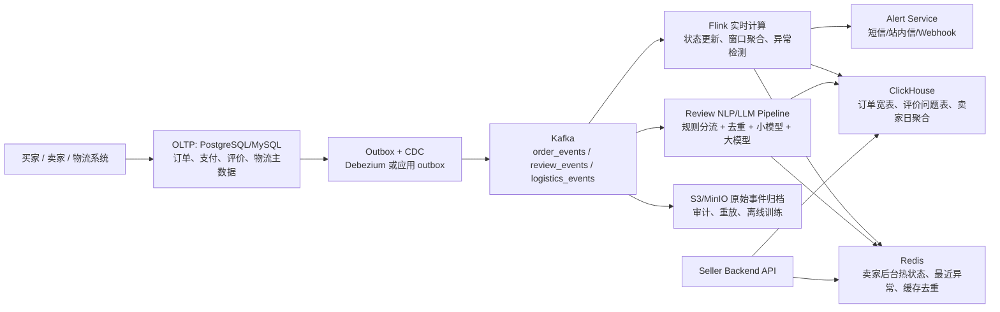

# REFLECTION.md - 反思文档

> 这份文档是笔试的**必填项**，请认真填写。
>
> 我们更关心**你的思考过程**，而不是最终代码。这份文档是你向我们展示自己的最好机会。
>
> 💡 **重要提示**：
> - 不要写"碰到一些问题"这种空话，请具体说明
> - 主动承认 AI 写的部分、你不完全理解的代码 —— **这是加分项不是减分项**
> - 指出题目本身的不合理之处 —— **这也是加分项**

---

## 📝 候选人信息

- **姓名**: 戴健恒
- **邮箱**：2822724509djh@gmail.com
- **完成日期**：2026-07-01
- **实际投入时间**：约 10 小时
- **最终 commit hash**：提交前填写

---

## ✅ 完成情况自评

| 模块 | 题号 | 完成度 | 自评分（满分） | 备注 |
|------|------|--------|---------------|------|
| 模块 1：数据质量探索 | Q1.1 | 90% | 6 / 8 | 已覆盖 5 个以上非显而易见问题，但还有一些现象可以更业务化排序 |
| | Q1.2 | 100% | 10 / 12 | Customer ID 缺失已做结构性解释，但没有进一步做聚类或渠道归因验证 |
| | Q1.3 | 100% | 4 / 5 | 已按销售、RFM、推荐模型区分清洗口径 |
| 模块 2：SQL 与业务分析 | Q2.1 | 100% | 5 / 5 | 找出翻译缺口并说明处理方案 |
| | Q2.2 | 100% | 8 / 8 | GMV 使用 `price + freight_value`，并处理 delivered/null 时间口径 |
| | Q2.3 | 100% | 8 / 8 | 使用 CTE、窗口函数，并先对 reviews 做订单粒度去重 |
| | Q2.4 | 50% | 1 / 4 | 识别了 JOIN 后 SUM 膨胀，但修正版 SQL 实测更慢，索引优化理解不够深入 |
| 模块 3：ETL Pipeline | Q3.1 | 90% | 18 / 20 | 已完成 pipeline、3 个 parquet 产物、日志、校验报告和测试；退货匹配采用保守 exact rule |
| 模块 4：LLM 抽取 | Q4.1 | 80% | 12 / 15 | DeepSeek full live 成本 14 RMB，低于 $3；但 47 分钟超过 40 分钟约束 |
| 模块 5：系统设计 | Q5.1 | 85% | 13 / 15 | 已给出实时架构、存储选型、LLM 成本控制和风险预案，但还可以补更细的容量估算 |
| 加分题 | Q6.1 | 90% | 9 / 10 | 已完成 Q1 AI 协作反向分析，记录了 prompt 迭代和 AI 误判 |
| | Q6.2 | 100% | 5 / 5 | 已基于 Olist 差评抽取、Online Retail 匿名订单和购物篮长尾提出 3 条业务建议 |

**基础题自评**：85 / 100  
**含加分题自评总分**：99 / 115

---

## 🔍 模块 1：数据质量探索

### 实现思路

我一开始不是直接写清洗规则，而是先把数据当成业务流水来理解。基础 EDA 只解决“字段长什么样”，真正关键的是把异常值还原成业务语义：哪些是销售，哪些是取消/退货，哪些是坏账，哪些是邮费或平台费用，哪些是库存损耗。

因此我先用 `describe()`、缺失率、重复行、TOP 值找可疑现象，再围绕 `Invoice` 前缀、`StockCode` 类型、`Quantity/Price` 极值、`Customer ID` 缺失做交叉验证。最后没有用一套通用清洗规则，而是拆成三种口径：gross product sales、net product sales、financial total，再分别服务销售报表、客户分群和商品推荐。

### 关键发现

1. `Invoice` 不只是数字。`C` 前缀有 19,494 行，基本是取消/退货；`A` 前缀只有 6 行，但对应 bad debt adjustment，金额影响很大。
2. `StockCode` 不全是商品。`POST`、`DOT`、`D`、`M`、`AMAZONFEE`、`BANK CHARGES` 等应从商品推荐和商品销售口径中排除，但财务对账时要保留并单列。
3. 最大 `Quantity = 80,995` 和最小 `Quantity = -80,995` 不是孤立错误，而是同一客户、同一商品、间隔 12 分钟的一正一负记录，更像大额误下单后快速取消。
4. `Price < 0` 不是负价商品，全部是 `A` 前缀的 bad debt adjustment。
5. `Price = 0 & Quantity < 0` 且非 `C/A` 单共有 3,457 行，Description 中大量出现 damaged、smashed、thrown away、unsaleable 等词，更像商品损坏或库存损耗。
6. `Customer ID` 缺失 243,007 行，占 22.77%，但金额占比只有 13.68%，且 98.77% 来自 UK。它不是随机空值，更像 UK dotcom/system/anonymous channel 与库存调整混在一起。
7. 推荐模型不能直接把所有 invoice 当普通购物篮。正向产品销售 invoice 的唯一商品数中位数是 15，但 P99 接近 197，最大达到 1,108，超大 basket 会放大共现关系。

### 遇到的坑

我最开始容易把“看起来脏”的数据直接当作要删除的异常，比如 `Quantity < 0`、`Price = 0`、缺失 `Customer ID`。后面发现这些现象不能一刀切：

- `C` 开头的负数量是退货/取消。
- 数字 invoice 里的 `Price = 0 & Quantity < 0` 更像库存损耗。
- `A` 前缀和 `Price < 0` 是坏账调整。
- 缺失 `Customer ID` 的主体仍然是正常正向销售，不能简单删除。

这个坑提醒我，数据质量题不是越“干净”越好，而是要保留对业务有解释力的异常，并在不同下游口径里区别处理。

### 未完成或不确定的部分

`Customer ID` 缺失群体我已经做了金额占比、国家分布、DOTCOM POSTAGE、损耗占比和 invoice 完整性分析，但还没有进一步用聚类或订单路径数据验证它到底是游客订单、系统渠道还是某类业务流程。当前结论是合理推测，不是完全证明。

---

## 📊 模块 2：SQL 与业务分析

### 实现思路

Q2 我使用 MySQL 8.0 方言完成，重点不是把 CSV 查出结果，而是保证指标粒度正确。Q2.2 先把 `order_items` 聚合到订单粒度再和 `orders` 连接，GMV 使用 `price + freight_value`；Q2.3 先把 `order_reviews` 按 `order_id` 去重/聚合，再计算卖家指标和州内排名；Q2.4 重点分析一对多 JOIN 后的统计膨胀和索引失效问题。

### Q2.4 第 3 问的思考

原 SQL 同时把 `order_items` 和 `order_reviews` 按 `order_id` 连接到 `orders`。这两张表对订单都可能是一对多，所以一个订单如果有 2 行商品、2 条评价，JOIN 后会变成 4 行。`COUNT(DISTINCT o.order_id)` 只能修正订单数，但 `SUM(oi.price)` 会被评价行数重复放大，`AVG(r.review_score)` 也会被商品行数影响。我的修正思路是先把商品金额和评价分数都预聚合到订单粒度，再回到州维度聚合。

### SQL 优化前后对比

| 查询 | 优化前耗时 | 优化后耗时 | 优化手段 |
|------|------------|------------|----------|
| Q2.4 原 SQL vs 当前修正版 | 435 ms | 1294 ms | 先按订单粒度聚合 `order_items` 和 `order_reviews`，修正 revenue 膨胀；但当前 CTE 写法在 MySQL 中重复扫描 `orders/customers`，所以实测更慢 |

### 遇到的坑

“逻辑正确”和“执行更快”不是一回事。当前修正版 SQL 口径更正确，但 `EXPLAIN ANALYZE` 显示 MySQL 把过滤订单、客户城市匹配、临时表物化在多个 CTE 分支里重复执行，导致从 435 ms 变成 1294 ms。

如果继续优化，我会把过滤后的订单先落到临时表并给 `order_id` 建主键，或者重写 CTE 让 `filtered_orders` 只计算一次。另外 `LOWER(customer_city) LIKE '%sao%'` 本身也很难走普通 BTree 索引，需要标准化城市列、生成列或专门的搜索结构。

---

## 🔄 模块 3：ETL Pipeline

### 实现思路

Q3 直接复用 Q1 已经验证过的数据语义，而不是重新写一套清洗规则。具体做法是从 `q1_data_quality/q1_code.py` 引入 `load_retail_data`、`build_work_table` 和 `classify_stock_code`，沿用 Q1 里的 `C` 取消/退货、`A` bad debt、非产品 StockCode、`Price=0 & Quantity<0` 商品损坏/库存损耗，以及 gross/net/financial 三种销售口径。

三个输出对应三个下游用途：

- `sales_facts.parquet`：只保留 gross product sales，即数字 Invoice、产品型 StockCode、`Quantity > 0`、`Price > 0`，用于 BI 报表。
- `customer_features.parquet`：只基于有 `Customer ID` 的真实销售计算 RFM，因为 Q1 已经证明缺失客户 ID 是结构性渠道问题，不能混入客户生命周期指标。
- `returns_log.parquet`：保留所有 `C` 开头 invoice 行，用于退货/取消审计，并额外输出 `matched_original_invoice`。

### 退货匹配的规则设计

**匹配规则**：

- 同一个 `customer_id`
- 同一个 `stock_code`
- 退货数量的绝对值等于原销售数量
- 原销售时间早于退货时间
- 多笔候选销售都符合时，选择离退货时间最近的一笔
- 只有负数量、产品型 StockCode、有客户 ID、正价格的 `C` 行参与匹配；其它 `C` 行保留在日志中，但不强行匹配

**为什么这么设计**：

这个规则是保守规则。它优先保证匹配出来的结果能解释，而不是追求把所有退货都猜出一个原单。题目特别强调 `CustomerID + StockCode + |Quantity| + 最近早于退货日期`，所以我用 `pandas.merge_asof` 在排序后的候选集上做最近前序匹配，避免 `iterrows()` 逐行查找。

我没有把 `C` 单直接从销售里删除后丢弃，而是单独做成 `returns_log`，因为 Q1 里已经看到极端值 `581483 / C581484` 这种一正一负记录很有审计价值。销售报表看 gross sales，退货分析看 returns log，两边口径分开。

**未覆盖的边界情况**：

- 如果客户买了 10 个，之后分两次退 5 个和 5 个，因为数量不完全相等，目前不会匹配。
- 如果一笔原销售数量小于退货数量，也不会匹配。
- 如果同一客户、同一商品、同一数量存在多次完全相同的退货，当前规则不会消耗原销售数量，可能多条退货指向同一个最近销售 invoice。
- 如果缺失 `Customer ID`，即使商品和数量看起来能对上，也不会匹配，因为这会引入过强猜测。

### 性能数据

- 总耗时：2.20 秒
- 内存峰值：876.66 MB
- 主要优化点：
  - 使用 pandas 布尔筛选和 groupby 生成 sales facts / RFM，不用全表 `iterrows()`。
  - 退货匹配用排序后的 `merge_asof`，按 customer、stock、quantity_abs 分组键找最近历史销售。
  - 输出前固定排序，保证相同输入每次产物顺序一致。
  - 只把必要字段写入 parquet，避免把 Q1 的中间派生字段全部带入下游。

### 数据校验

最终运行时 assertion 没有失败。校验内容包括：

- `sales_facts` 的 `quantity > 0`、`unit_price > 0`、`total_amount > 0`
- `customer_features` 的 `customer_id` 非空、`frequency >= 1`、`recency_days >= 0`、`monetary >= 0`
- `returns_log` 只包含 `C` 开头 invoice，且 `matched_original_invoice` 不指向 `C` 单

真实数据输出结果：

- `sales_facts`：1,036,877 行，金额合计 20,108,995.40，和 Q1 的 gross product sales 对齐
- `customer_features`：5,852 个可识别客户
- `returns_log`：19,494 行 `C` invoice，其中 17,933 行符合退货匹配候选条件，6,509 行找到 exact prior sale，候选退货匹配率 36.30%

过程中发现一个实现 bug：第一次运行时 parquet 已写出，但 `validation_report.md` 生成失败，原因是 f-string 中 `rename(columns={"index": "metric"})` 误写成双花括号。修复后补了 report smoke test，防止同类问题再次出现。

---

## 🤖 模块 4：LLM 抽取

### 分流策略

**用规则处理的评论占比**：55.6%（7,554 / 13,592 条去重文本）  
**用 LLM 处理的评论占比**：44.4%（Small LLM 4,836 条，Large LLM 1,202 条）

Q4 只处理 `review_score <= 3` 的低分评论，共 22,754 条，其中空文本 8,117 条。为了控制成本，我先按 `normalized_text` 去重，得到 13,592 条代表文本。空评论、极短评论、高置信关键词评论走 Rule Engine；短但有明确业务信息的评论走 Small LLM batch；长文本、多问题、Small LLM 低置信或校验失败的样本才升级到 Large LLM。

本次 full live 中，初始路由为 Rule Engine 7,554 条、Small LLM 4,836 条、Large LLM 1,202 条。实际 method 统计里，Small/Large LLM 成功返回 3,525 条，另有 2,513 条进入 offline fallback 或人工复核路径。

### 小样本验证到全量 Live

我没有一开始就直接跑全量 live，因为 Q4 同时受成本、时长和模型稳定性约束。我的实现思路是先用小样本按比例分层抽取：低分评论先经过 Rule Engine，剩余样本再按实际路由比例抽到 Small LLM 和 Large LLM 两条链路，尽量让样本能代表真实 full run 的分布。

具体步骤是先分别抽取 30 条、90 条和 300 条几种规模的样本，把样本喂给模型，观察 JSON schema、evidence、分类准确率、失败率和耗时是否能达到要求。30 条用于快速看 prompt 和 schema 是否可用；90 条用于做三轮分层评估，降低单次抽样偶然性；300 条用于更接近真实路由比例地估算成本、耗时和失败重试数量。基于这些小样本结果，我再推算全量 13,592 条去重文本的调用量、token、账单和运行时长，最后才做一次 full live 验证。

### Prompt 设计的关键决策

Prompt 的核心约束是“只基于原文证据抽取”。模型必须输出固定 JSON schema，`category/subcategory` 只能从预定义标签里选，`evidence` 必须是葡萄牙语原文中的连续片段，不能把英文翻译当证据。对于信息不足的短评，不允许模型猜测物流、商品或卖家责任，而是输出 `general.unclear` 或 `needs_manual_review=true`。葡萄牙语不单独调用翻译模型，由 LLM 在同一次结构化输出中补 `evidence_quote_en`，减少额外调用和对齐误差。

### 成本数据

- 实际花费：14 RMB（DeepSeek 后台账单；低于 $3 预算）
- 总 token 数：2,874,384（服务端返回输入 612,111，输出 2,262,273）
- 单条评论平均成本：约 0.00062 RMB / 条低分评论，或 0.00103 RMB / 条去重文本
- LLM 调用次数：2,259
- LLM 失败次数：214；schema 校验失败 118；evidence 校验失败 83
- 如果不做分流和去重，成本、失败重试和运行时间都会显著上升

### 准确率评估

由于没有 ground truth，我没有只抽 30 条就结束，而是从 live full run 输出中做 3 轮 repeated 30-sample validation batches。每轮 Rule Engine、Small LLM、Large LLM 各抽 10 条，三轮共 90 条，不重复。抽样时先筛选 `method in (rule, small_llm, large_llm)` 且 `raw_text` 非空，再按 `review_id + raw_text` 的稳定 hash 排序，保证可复现。人工标注时只看 `raw_text`，再对比模型输出的分类、evidence、漏召回、幻觉和 actionable 判断。

实测结果：

- 分类准确率：88.9%（80 / 90）
- evidence 合规率：92.1%（105 / 114）
- 漏召回率：11.3%（13 / 115）
- 幻觉率：5.3%（6 / 114）
- actionable 判断准确率：95.6%（86 / 90）

分层看，Rule Engine 是主要短板：幻觉率 15.8%，漏召回率 27.0%；Small LLM 和 Large LLM 的 evidence 合规率分别为 97.0% 和 95.3%，90 条样本中没有发现 LLM 路径的明显幻觉问题。

### 未达标部分

full live 用时 47 分钟，超过题目 40 分钟约束 7 分钟。原因不是单条成本太高，而是 Large LLM 单条调用、失败重试、schema/evidence 校验和 fallback 拉长了总时间。如果继续优化，我会保留默认 budget gate，并进一步减少 Large LLM 覆盖面：低价值低置信样本直接进入人工复核，只有退款、错发、损坏、缺件、客服无响应等高价值信号才升级。

---

## 🏗️ 模块 5：系统设计

### 架构图

### 关键技术决策的理由

交易系统仍然以 OLTP 为事实源，订单、支付、评价、物流轨迹先写入 PostgreSQL/MySQL；实时链路不直接接管交易一致性。每次业务写库同时写 outbox 表，再由 CDC 推送到 Kafka，避免出现“数据库提交成功但事件发送失败”的不一致。

Kafka 按 `seller_id` 或 `order_id` 分区，拆成订单状态、评价、物流三类 topic，既能削峰，也能在下游故障后重放。Flink 负责状态更新、窗口聚合和物流异常检测。Redis 只存卖家后台热状态、最近异常和短 TTL 缓存；历史曲线、评价问题宽表和卖家日聚合放入 ClickHouse，通过分区、排序键和物化视图支撑 6 个月历史查询的毫秒级响应。S3/MinIO 保留原始事件，用于审计、backfill 和离线训练。

LLM 部分不让每条评价直接过大模型，而是复用 Q4 的经验：先过滤高分或无文本评价，再按 `normalized_text` 去重，规则处理极短/高置信模板，短文本走小模型 batch，只有长文本、多问题、低置信或高价值卖家问题才升级大模型。所有结果按 `review_id + text_hash + model_version` 缓存，避免重复付费。

### 你方案的三大风险

1. **事件丢失、重复或乱序导致卖家看到错误状态。** 预案是 outbox + CDC、事件版本号、幂等 upsert、watermark 处理迟到事件，以及 dead letter queue 修复后重放。
2. **实时链路积压，无法满足 30 秒/1 分钟 SLA。** 预案是订单状态、物流报警、LLM 抽取拆 topic 和 consumer group；订单状态优先级最高；Kafka lag、Flink checkpoint、LLM 队列等待时间都设置告警；压力上来时优先降级非关键 LLM 任务。
3. **OLAP 和缓存结果与事实源漂移。** 预案是每日用 OLTP/对象存储快照做 reconciliation，核对订单数、GMV、取消率和评价数；Redis 只存可重算热数据，异常时回退到 ClickHouse。

---

## 🤖 关于 AI 使用的诚实声明

### 你在哪些题上重度依赖 AI？

Q4 的代码骨架、CLI 参数和路由实现重度依赖 AI，包括 Rule Engine、Small/Large LLM 分流、batch 调用、并发调度和结果合并逻辑。但我没有直接照抄结果，而是根据题目约束补了去重、成本报告、live/offline 两套运行路径，并用 DeepSeek 做了一次 full live 验证。最终 full live 用时 47 分钟，实际账单成本 14 RMB。

Q3 也使用了 AI 辅助实现，尤其是工程结构、日志、校验报告和测试组织。但核心业务规则来自 Q1 的数据语义：什么算真实销售、什么算退货、哪些 StockCode 不是产品，以及为什么退货匹配要采用保守 exact rule。

### 哪些代码你不完全理解？

Q4 中 CLI 参数、live/offline 输出路径、并发任务调度和 fallback 边界不是完全由我独立写出的。我能解释整体输入输出、为什么要分流、为什么要 evidence 校验，也能读懂主要数据流；但对每个 argparse 参数与并发任务之间的细节边界还需要继续熟悉。

Q2.4 的 MySQL 执行计划和索引优化也不是我最有把握的部分。我能指出 `LOWER(...) LIKE '%sao%'`、一对多 JOIN、CTE 物化和聚合粒度问题，但没有把 SQL 真正优化到比原始版本更快。

### 你认为 AI 在哪些题上帮不上忙？

AI 对 Q1 只能提供探索 checklist，不能替我确认业务语义。比如 `Price = 0 & Quantity < 0` 到底是脏数据、退货还是损耗，必须回到原始 Description 和数量/金额组合里验证。

AI 对 Q4 pipeline 也不能自动保证达标。它可以快速生成代码，但如果没有我明确要求成本预算、去重、evidence 校验、schema 校验和 live/offline 路径，很容易写成“所有评论都丢给模型”的方案，看起来完整但不符合题目成本和时长约束。

### 你用 AI 时最大的翻车经验

Q4 最大的问题是多轮迭代后，AI 一度把我原本设计里很重要的 `normalize_text` / 去重逻辑弱化了，导致很多相似评论没有在模型调用前充分合并。这个问题会直接放大 token 消耗、调用次数和运行时间。后来我补回标准化、hash 去重和规则优先路由，但 full live 仍然用了 47 分钟，比题目 40 分钟约束多 7 分钟。

这次经验说明，AI 可以快速搭 pipeline，但成本控制这种题必须自己盯住数据规模、去重口径和真实账单，不能只看模型生成的估算。

---

## 💡 对本次笔试的反馈（加分项！）

### 你认为哪道题设计不合理？

Q4 的 40 分钟和 $3 预算也很真实，但需要候选人实际跑一次模型才知道瓶颈在哪里。这个设计能区分只写方案和真正验证的人，但也会受 provider 稳定性、网络、并发限制影响。我的结果是成本达标、时间略超，所以这个题对“工程验证边界”的要求比较高。

### 你认为哪道题最能区分候选人能力？

我认为 Q1,Q4 最能区分能力。

Q1 区分的是数据敏感性：能不能把异常值解释成业务语义，而不是只写缺失值和 describe。Q4 区分的是工程成本意识：不是会不会调 LLM，而是能不能在预算、时间、schema、证据和人工评估之间做权衡。

### 如果再做一次，你会怎么改进自己的提交？

1. Q2.4 我会更早用 `EXPLAIN ANALYZE` 迭代，而不是最后才发现修正版口径正确但更慢。
3. Q5 我会补更细的容量估算，例如 Kafka 分区数、ClickHouse 分片、Redis key TTL、LLM worker 并发和队列积压阈值。

---

## 📌 给面试官的提示

---

**感谢你的认真填写！期待与你在面试中交流。**
