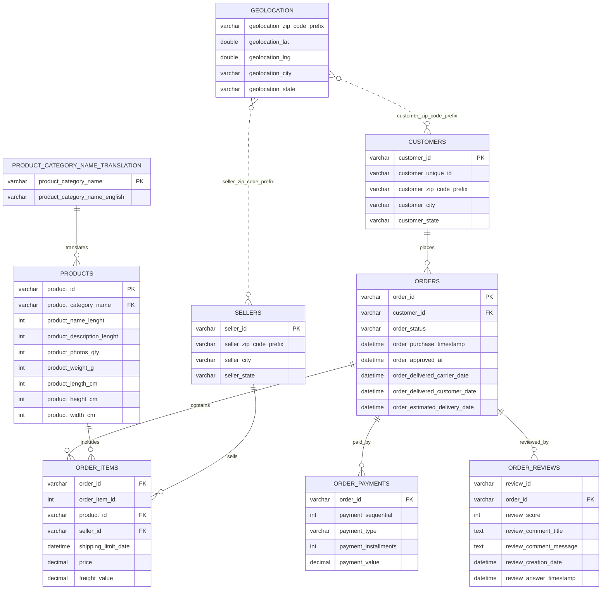

```mermaid
erDiagram
    CUSTOMERS ||--o{ ORDERS : places
    ORDERS ||--o{ ORDER_ITEMS : contains
    ORDERS ||--o{ ORDER_PAYMENTS : paid_by
    ORDERS ||--o{ ORDER_REVIEWS : reviewed_by
    PRODUCTS ||--o{ ORDER_ITEMS : includes
    SELLERS ||--o{ ORDER_ITEMS : sells
    PRODUCT_CATEGORY_NAME_TRANSLATION ||--o{ PRODUCTS : translates
    GEOLOCATION }o..o{ CUSTOMERS : customer_zip_code_prefix
    GEOLOCATION }o..o{ SELLERS : seller_zip_code_prefix

    CUSTOMERS {
        varchar customer_id PK
        varchar customer_unique_id
        varchar customer_zip_code_prefix
        varchar customer_city
        varchar customer_state
    }

    ORDERS {
        varchar order_id PK
        varchar customer_id FK
        varchar order_status
        datetime order_purchase_timestamp
        datetime order_approved_at
        datetime order_delivered_carrier_date
        datetime order_delivered_customer_date
        datetime order_estimated_delivery_date
    }

    ORDER_ITEMS {
        varchar order_id FK
        int order_item_id
        varchar product_id FK
        varchar seller_id FK
        datetime shipping_limit_date
        decimal price
        decimal freight_value
    }

    ORDER_PAYMENTS {
        varchar order_id FK
        int payment_sequential
        varchar payment_type
        int payment_installments
        decimal payment_value
    }

    ORDER_REVIEWS {
        varchar review_id
        varchar order_id FK
        int review_score
        text review_comment_title
        text review_comment_message
        datetime review_creation_date
        datetime review_answer_timestamp
    }

    PRODUCTS {
        varchar product_id PK
        varchar product_category_name FK
        int product_name_lenght
        int product_description_lenght
        int product_photos_qty
        int product_weight_g
        int product_length_cm
        int product_height_cm
        int product_width_cm
    }

    SELLERS {
        varchar seller_id PK
        varchar seller_zip_code_prefix
        varchar seller_city
        varchar seller_state
    }

    PRODUCT_CATEGORY_NAME_TRANSLATION {
        varchar product_category_name PK
        varchar product_category_name_english
    }

    GEOLOCATION {
        varchar geolocation_zip_code_prefix
        double geolocation_lat
        double geolocation_lng
        varchar geolocation_city
        varchar geolocation_state
    }
```