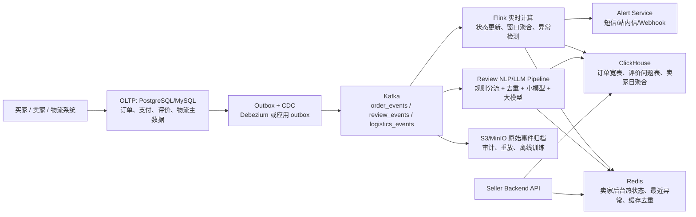

# Q5.1 - 实时数据管道设计

## 1. 整体架构图

交易系统仍然以 OLTP 为事实源，订单、支付、评价、物流轨迹先写入 PostgreSQL/MySQL；实时链路不直接接管交易一致性。每次业务写库同时写 outbox 表，再由 CDC 推送到 Kafka，避免出现“数据库提交成功但事件发送失败”的不一致。Kafka 按 `seller_id` 或 `order_id` 分区，拆成订单状态、评价、物流三类 topic，既能削峰，也能在下游故障后重放。

Flink 消费 Kafka 后分三条链路处理。订单状态链路把 `created/paid/shipped/delivered/canceled` 等变更写入 Redis 和 ClickHouse，卖家后台 30 秒内优先从 Redis 读到最新状态；历史曲线、按品类/地区/月份聚合则查 ClickHouse。物流链路根据 `estimated_delivery_date`、最新 carrier scan 和当前状态判断延迟，触发 Alert Service，并用 Redis 做报警去重，避免同一订单反复打扰卖家。评价链路先进入 Review NLP/LLM Pipeline，在 1 分钟内完成情感和问题抽取，结构化结果写入 `fact_review_issue`，用于卖家后台展示“延迟、未收到、质量差、客服无响应”等可行动问题。

## 2. 数据存储选型

OLTP 存交易事实，包括订单、订单明细、支付、评价原文、卖家和客户信息，原因是这些数据需要事务一致性、主键约束和可回滚能力。Kafka 只存事件，不作为查询库；它的价值是解耦上下游、支持 consumer group、保留短期事件用于重放。ClickHouse 存面向分析的宽表和聚合表，例如 `fact_order_status`、`fact_review_issue`、`agg_seller_daily_sales`，按日期分区、按 `seller_id, event_date` 排序，并用物化视图提前维护 6 个月成交曲线，所以历史查询可以做到毫秒级。Redis 只存热数据：最近订单状态、卖家首页指标、报警去重 key 和短 TTL 的查询结果，不能把它当主存储。对象存储保存原始事件和离线快照，用于 backfill、审计和模型训练。

## 3. LLM 成本控制

100 万订单/天如果假设每单最多一条评价，就是 3.65 亿条评价/年。按每条评价平均 1000 tokens、综合单价 1 美元/百万 tokens 估算，年成本约 36.5 万美元；如果使用更贵的通用大模型，综合单价到 5 美元/百万 tokens，年成本会接近 182.5 万美元，还没有算失败重试和人工复核。Q4 的真实 full live 运行也说明，LLM 调用会产生失败、schema 校验失败和 evidence 校验失败，不能只看单次 token 单价。

所以生产方案不让每条评价直接过大模型。第一层跳过无文本、高分且无投诉信号的评价；第二层对 `normalized_text` 做 hash 去重，同一模板评论只处理一次；第三层用规则处理空文本、极短文本和高置信关键词；第四层短文本走小模型 batch，只有长文本、多问题、低置信或高价值卖家评价才升级到大模型。所有结果按 `review_id + text_hash + model_version` 缓存，重跑时不重复付费；队列侧设置每日预算、并发上限和降级策略，超过预算时先返回规则/小模型结果，并把低置信样本进入人工复核队列。

## 4. 三个最大风险点和预案

**风险 1：事件丢失、重复或乱序导致卖家看到错误状态。** 预案是 outbox + CDC 保证事件可追踪；每个事件带 `event_id`、`order_id`、`event_time` 和版本号；Flink 按订单做幂等 upsert，并用 watermark 处理迟到事件。无法解析的事件进入 dead letter queue，修复后重放。

**风险 2：实时链路积压，无法满足 30 秒/1 分钟 SLA。** 预案是把订单状态、物流报警、LLM 抽取拆成不同 topic 和 consumer group，订单状态优先级最高；Kafka lag、Flink checkpoint、LLM 队列等待时间都设置告警。压力上来时先扩 Flink 并行度和 LLM worker，再降级非关键 LLM 任务，保证卖家至少先看到订单状态和物流异常。

**风险 3：OLAP 和缓存结果与事实源漂移。** ClickHouse 聚合可能因为迟到事件、重复事件或回补任务产生偏差，Redis 热缓存也可能过期策略错误。预案是每日用 OLTP/对象存储快照做批量 reconciliation，核对订单数、GMV、取消率和评价数；ClickHouse 表按月份 TTL 分层，Redis 只保留可重新计算的数据，缓存 miss 或异常时回退到 ClickHouse 查询。

## 5. 规模变化

10 万订单/天时，可以使用托管 Kafka、小规模 Flink 集群、单 ClickHouse shard 加副本和 Redis 主从，重点是把链路跑通并监控端到端延迟。增长到 100 万订单/天后，架构重点变成分区和成本治理：Kafka topic 增加分区并固定分区键，Flink 按 seller/order key 扩并行度，ClickHouse 做分片、副本、物化视图和冷热 TTL，LLM 管道独立排队并按预算限流。这样核心订单状态仍能近实时展示，而昂贵的文本理解任务可以异步、可降级、可审计地运行。
